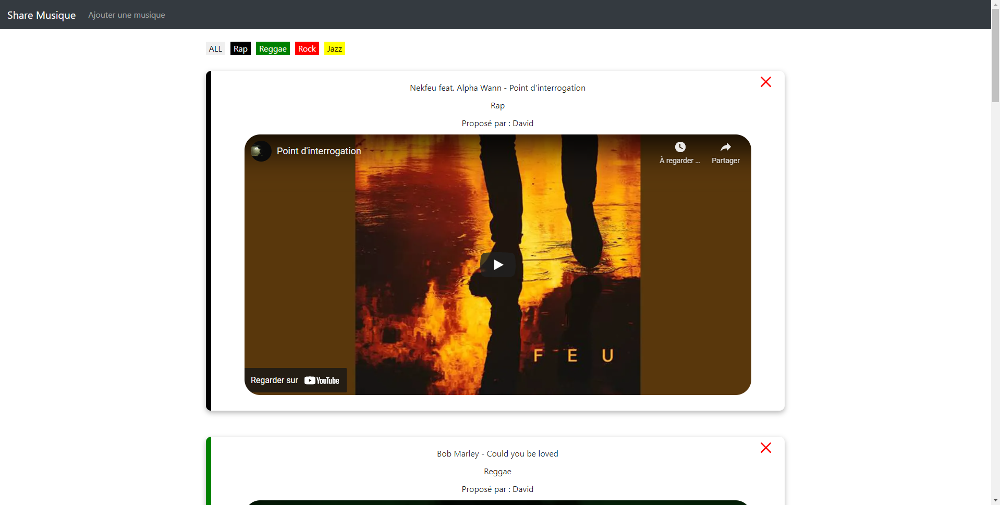
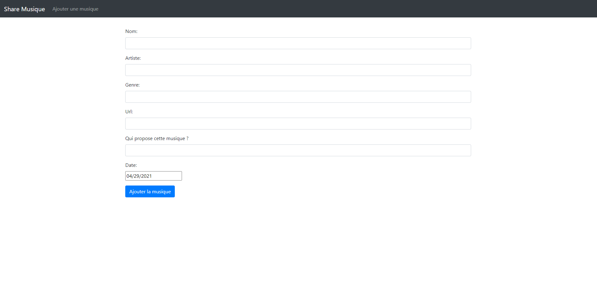
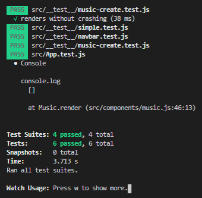

### Projet de tests unitaires

Specification fonctionnelle:

Notre projet est un MERN Stack (créé avec Mongo db, Express js, React js, Node js). Il permet de partager et faire découvrir une variété de musiques aux internautes et utilisateurs connectés.  

On peut créer afficher supprimer et modifier des morceaux, leur artiste, et les répertorier par genre (avec un code couleur) et utilisateur qui les ajoute.  

Les utilisateurs et genres sont enregistrés dans la base de données mongo.

## Fonctionnement

Pour lancer le projet il faut :  
- se placer dans le dossier backend et lancer la commande __"nodemon server"__
- se placer à la racine du projet et lancer la commande __"npm start"__

Pour lancer les tests, il suffit de lancer la commande __"npm run test"__

